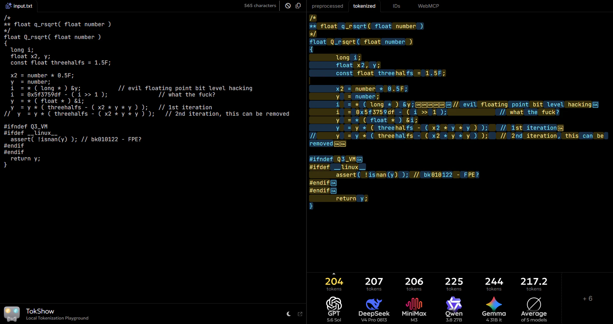

# TokShow

web app for local LLM tokenization with support for a wide range of popular models and vocabularies

## screenshots

## license

[MIT License](https://github.com/Jaid/tok.show/raw/HEAD/license.txt) Copyright © 2026, Jaid \<jaid.jsx@gmail.com> (https://github.com/jaid)

<!--
readme generated with tldw v9.7.0 from ./docs and ./docs/tldw
github.com/Jaid/tldw
-->
